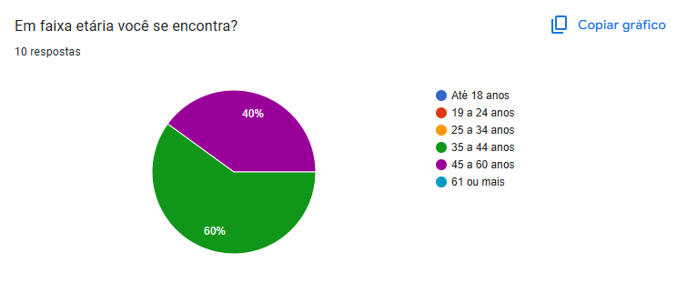
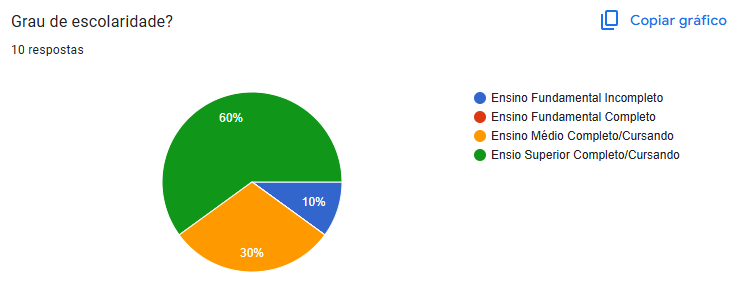
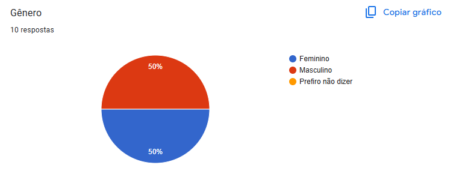
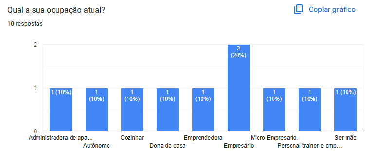
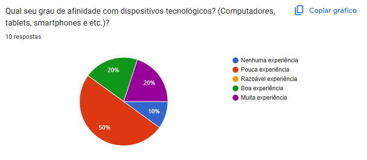
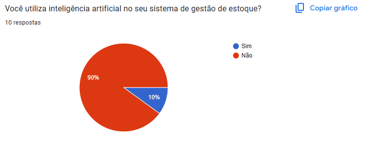
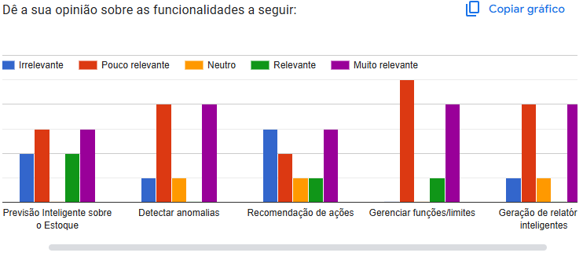
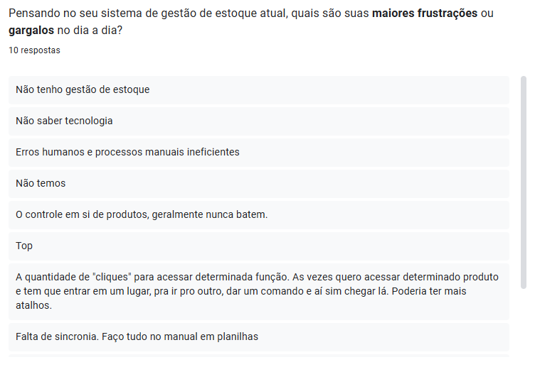
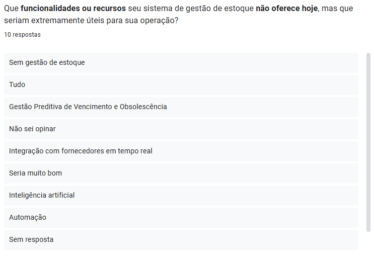
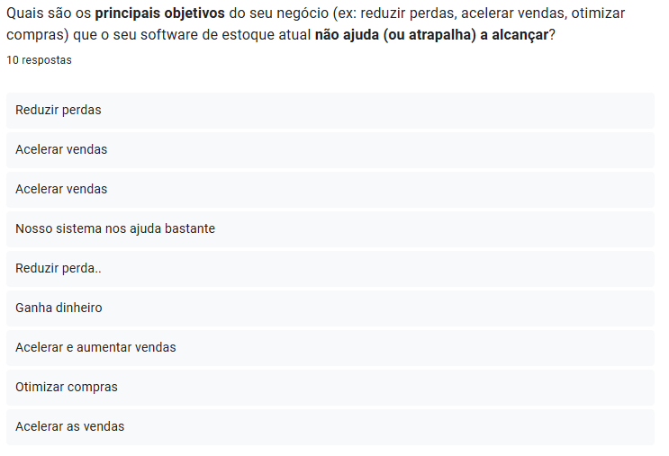

# Questionário

## Introdução
A utilização de questionários como parte do processo de criação de perfis de usuário oferece uma série de vantagens notáveis. Eles permitem a coleta de informações de maneira estruturada e quantificável, o que facilita a análise e a interpretação dos dados obtidos. Além disso, questionários podem ser administrados a um grande número de respondentes de forma eficiente, tornando possível a criação de perfis de usuário representativos de uma base diversificada de usuários potenciais. 

O uso do questionário permitir abordar de forma concisa uma série de tópicos relevantes, para definição do perfil de usuário. Portanto, a escolha deste método de pesquisa está alinhada com os objetivos estabelecidos, garantindo que as informações coletadas sejam abrangentes e pertinentes para informar as decisões futuras de desenvolvimento e aprimoramento do aplicativo.

## Metodologia 
Pensando nisso foi realizado a elaboração de um questionário através do google-forms^1^ com intuito de conhecer o perfil de usuário do software EstocAI. O questionário engloba um total 10 perguntas sobre aspectos gerais sobre sistemas de gestão de estoque e foi divulgado em grupos da comunidade acadêmica da UnB - FGA atráves do aplicativo whatsapp e entre o período de 01 a 10 de Novembro de 2025. 

### Perguntas Realizadas

A tabela 1 contém a seleção das perguntas utilizadas no questionário, a seleção das perguntas tem como base a especificação do perfil de usuário .

**Tabela 1:** questões do questionário

|ID|Pergunta|
|:--|:-|
| 1 | Em faixa etária você se encontra?|
| 2 | Grau de escolaridade? |
| 3 | Gênero? |
| 4 | Qual a sua ocupação atual? |
| 5 | Qual seu grau de afinidade com dispositivos tecnológicos? (Computadores, tablets, smartphones e etc.)? |
| 6 | Você utiliza inteligência artificial no seu sistema de gestão de estoque? |
| 7 | Dê a sua opinião sobre as funcionalidades a seguir (Previsão Inteligente sobre o Estoque, Detectar anomalias, Recomendação de ações, Gerenciar funções/limites, Geração de relatórios inteligentes) |
| 8 | Pensando no seu sistema de gestão de estoque atual, quais são suas maiores frustrações ou gargalos no dia a dia? |
| 9 | Que funcionalidades ou recursos seu sistema de gestão de estoque não oferece hoje, mas que seriam extremamente úteis para sua operação? |
| 10 | Quais são os principais objetivos do seu negócio (ex: reduzir perdas, acelerar vendas, otimizar compras) que o seu software de estoque atual não ajuda (ou atrapalha) a alcançar? |

Fonte: [Luis Miranda](https://github.com/LuisMiranda10) 

### Resultado do questionário 
O resultado no questionário teve o total de 10 respostas, com todas de acordo com o  [Termo de consentimento](TermoDeConsentimento.pdf.pdf). O resultado das respostas são apresentados nas figuras de 1 a 10.

#### Questão 1 - Em faixa etária você se encontra?

<b>Figura 01</b>

#### Questão 2 - Grau de escolaridade?

<b>Figura 02</b>

#### Questão 3 - Gênero?

<b>Figura 03</b>

#### Questão 4 - Qual a sua ocupação atual?

<b>Figura 04</b>

#### Questão 5 - Qual seu grau de afinidade com dispositivos tecnológicos? (Computadores, tablets, smartphones e etc.)?

<b>Figura 05</b>

#### Questão 6 - Você utiliza inteligência artificial no seu sistema de gestão de estoque?

<b>Figura 06</b>

#### Questão 7 - Dê a sua opinião sobre as funcionalidades a seguir (Previsão Inteligente sobre o Estoque, Detectar anomalias, Recomendação de ações, Gerenciar funções/limites, Geração de relatórios inteligentes)

<b>Figura 07</b>

#### Questão 8 - Pensando no seu sistema de gestão de estoque atual, quais são suas maiores frustrações ou gargalos no dia a dia?

<b>Figura 08</b>

#### Questão 9 - Que funcionalidades ou recursos seu sistema de gestão de estoque não oferece hoje, mas que seriam extremamente úteis para sua operação?

<b>Figura 09</b>

#### Questão 10 - Quais são os principais objetivos do seu negócio (ex: reduzir perdas, acelerar vendas, otimizar compras) que o seu software de estoque atual não ajuda (ou atrapalha) a alcançar?

<b>Figura 10</b>

## Referência bibliografica

> Google LLC. Google Forms. Disponível em: [https://www.google.com/intl/pt-BR/forms/about/](https://www.google.com/intl/pt-BR/forms/about/). Acesso em: 29/09/2023.

## Bibliografia
> BARBOSA, S. D. J.; SILVA, B. S. Interação Humano-Computador. Rio de Janeiro: Elsevier, 2011.

### Histórico de Versão

| Versão | Data       | Descrição                                               | Autores                        | Revisores |
| ------ | ---------- | ------------------------------------------------------- | ------------------------------ | --------- |
| 1.0    | 17/11/2025 | Criação do documento |  [Luis Miranda](https://github.com/LuisMiranda10) |  [Vinícius Mendes](https://github.com/yabamiah)  